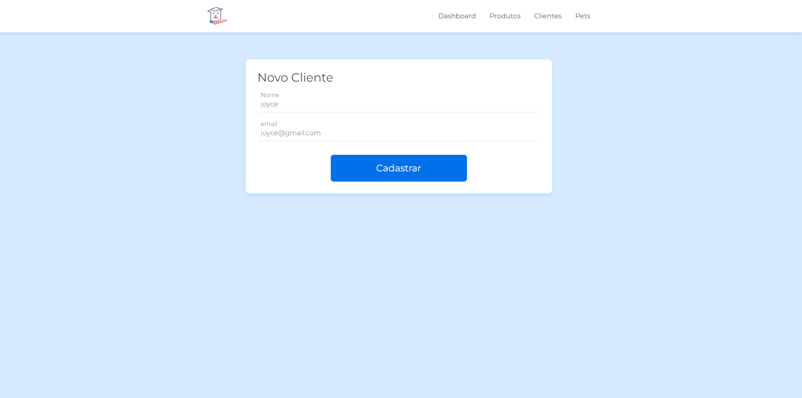

# CRUD JS 
<h1>
    
    
</h1>

# Indice

- [Sobre](#-sobre)
- [Tecnologias utilizadas](#-tecnologias-utilizadas)
- [Como baixar o projeto](#-como-baixar-o-projeto)

## 🔖&nbsp; Sobre

O projeto **Crud-js-alura** é um CRUD que foi criado dentro do curso [JS na WEB: CRUD com javascript assíncrono, Alura](https://www.alura.com.br) com o intuito de colocar em prática todo conteúdo estudado durante o curso

---

## 🚀 Tecnologias utilizadas

O projeto foi desenvolvido utilizando as seguintes tecnologias

- [HTML](https://developer.mozilla.org/pt-BR/docs/Web/HTML)
- [CSS](https://developer.mozilla.org/pt-BR/docs/Web/CSS)
- [Javascript](https://developer.mozilla.org/pt-BR/docs/Web/JavaScript)

---

## 🗂 Como baixar o projeto

```bash
    # Clonar o repositório
    $ git clone https://github.com/KellyVasconcellos/crud-js-alura.git
    # Entrar no diretório
    $ cd crud-js-alura
```

---

Desenvolvido 💜 por Kelly Vasconcellos
